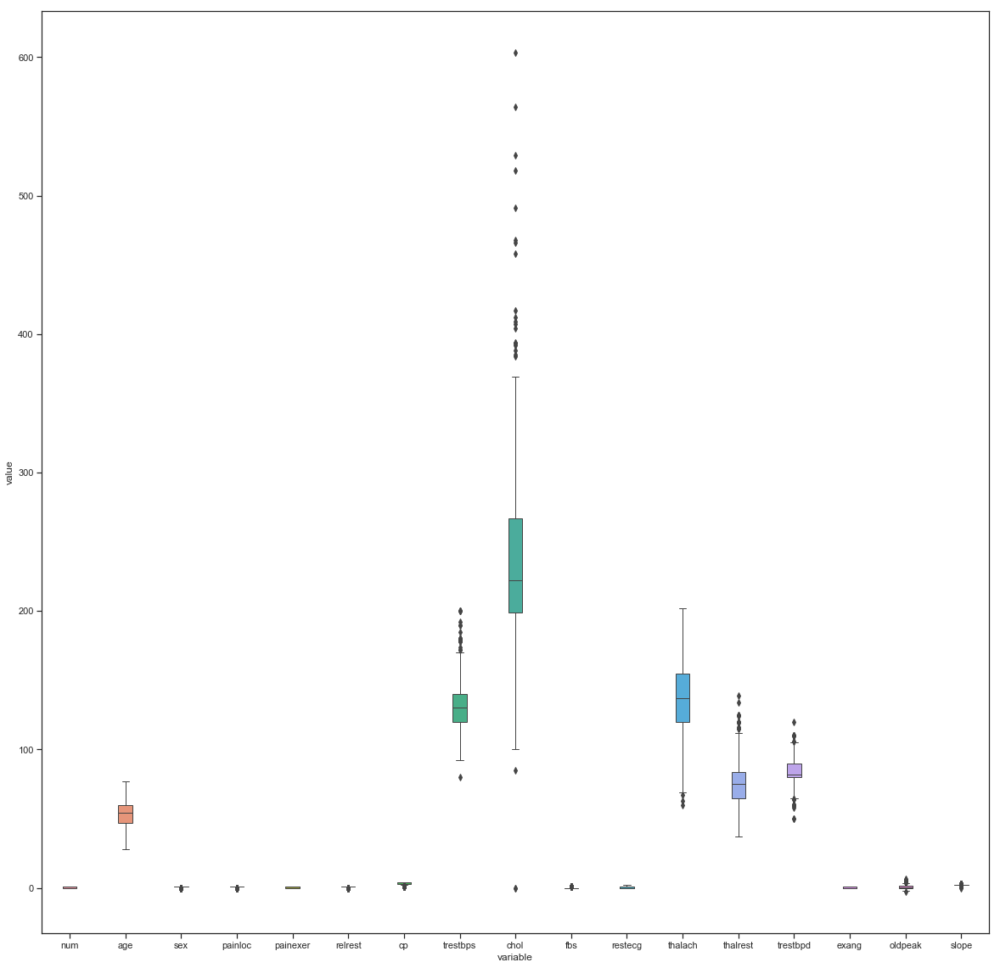
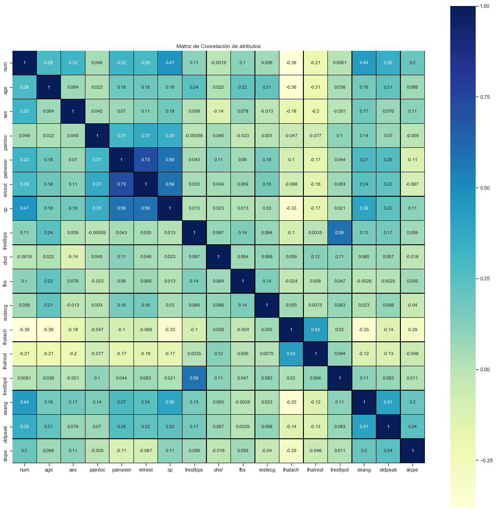

<center><h1> Proyecto Final: Estudio de enfermedades cardíacas. </h1></center>


Este problema está basado en el estudio de enfermedades cardíacas. Para esto me baso en el estudio de un conjunto de 4 datasets correspondientes al relevamiento de datos tomados de 4 lugares geográficamente distantes (Cleveland / EE.UU. EAST, Hungría, Suiza, y VA Long Beach / EE.UU. WEST), obtenidos del repositorio de Machine Learning, del sitio web de la Universidad de California (UCI). La URL donde el mismo está disponible, es la siguiente: https://archive.ics.uci.edu/ml/datasets/heart+Disease .
Dado lo costoso de los tratamientos médicos para enfermedades cardíacas, la idea es predecir los pacientes con mayor riesgo de poseer enfermedades cardíacas (tanto en la actualidad como a futuro), y así poder gestionar más eficientemente los recursos para tratar este tipo de pacientes de forma preventiva, y no reactiva. Sabiendo que los costos de tratamiento reactivo son muchísimos mayores que los de tratamiento preventivo, esto nos ayudaría a disminuir la cantidad de tratamientos reactivos, y a su vez evitar posibles cuadros cardíacos.
Dichos datasets poseen el mismo formato de datos, conteniendo los mismos atributos. Lo fundamental de la distancia entre dónde se tomaron los datos, es que son geográficamente distantes. A partir de esto podemos generalizar que dichas relaciones entre los datos (así como las predicciones) se cumplen no sólo en una región en particular, sino que nos independizamos de la ubicación geográfica. Se pretende predecir si el paciente ya padece (o padecerá) una enfermedad cardíaca, a partir de la información provista por estos datasets.
Con respecto al conjunto de datasets elegidos para este problema, la mayoría de los papers que han utilizado éstos datasets en  sus investigaciones, en la gran mayoría de los casos utilizaron sólo 14 de los 76 atributos del conjunto de datasets (recordemos que los 4 datasets tienen los mismos atributos, distribuídos en el mismo orden). Luego de realizar un estudio de los mismos (más adelante se detallará el porqué para cada atributo) entiendo que es interesante el uso de 20 de los 76 atributos totales, ya que hay atributos directamente influyentes, así como inversamente influyentes en la probabilidad de un correcto diagnóstico de una enfermedad cardíaca. En la mayoría de los casos, a pesar de que un atributo puede no influir directamente en la probabilidad de tener enfermedades cardíacas, cuando se los evalúa en conjunto con algunos atributos más aumenta significativamente la probabilidad. Un ejemplo claro de esto es una persona de 50 años, que no hace deporte, fuma, y su ritmo cardíaco en reposo es elevado, esto hace que haya altas probabilidades de que ésta persona pueda tener una enfermedad cardíaca a futuro cercano. 


### Sistema Circulatorio Humano ###


El Sistema Circulatorio tiene como función principal la distribución de nutrientes, hormonas, gases (O2), y células sanguíneas a las células en el resto del cuerpo. También se encarga de recoger los desperdicios generados por el metabolismo de las células del cuerpo (por ejemplo, CO2). Está compuesto por el corazón, vasos sanguíneos (venas, capilares, y arterias) y la sangre. Los órganos que se encargan de eliminar los mencionados desechos son los riñones (a través de la orina), y los pulmones (vía aérea, al exhalar CO2). Para entender mejor el problema que estamos abordando, es necesario entender (al menos básicamente) su funcionamiento. Para ésto, a continuación se expone una breve introducción (mini resúmen, a grandes rasgos) de cómo funciona el sistema:


**1.**	El corazón recibe sangre desoxigenada a través de las venas cavas (superior e inferior), esta sangre entra en el aurículo derecho.

**2.**	El aurículo derecho se comprime, pasando la sangre (a través de la válvula tricúspide) al ventrículo derecho.

**3.**	El ventrículo derecho se comprime, enviando la sangre en el mismo hacia la arteria pulmonar (a través de la válvula pulmonar).

**4.**	La sangre se oxigena en los pulmones, para luego ingresar nuevamente al corazón a través de la vena pulmonar, ingresando en el aurículo izquierdo.

**5.**	El aurículo izquierdo se comprime, mandando la sangre (a través de la válvula mitral) al ventrículo izquierdo (sangre oxigenada y con nutrientes).

**6.**	El ventrículo izquierdo se comprime, y envía la sangre oxigenada (a través de la válvula aórtica) hacia la Arteria aorta, para que de esta manera se envíe sangre oxigenada al resto del cuerpo.


### Análisis del Dataset ###

Este conjunto de datasets contienen 76 atributos (los mismos atributos para los 4 datasets), y un total de 899 tuplas. El mismo contiene outliers, así como missing values. Estos dataset tienen un label llamado "num", el cual varía entre 0 y 4. Este atributo corresponde a si el paciente tiene o no enfermedades cardíacas. Esto nos permite poder utilizar este dataset, tanto para algoritmos supervisados, así como para algoritmos no supervisados. A continuación se analizan los atributos del dataset (tal cual está en UCI):


| Nº  |   Name  |            Description                |     Type of Data       |
|-----|---------|---------------------------------------|------------------------|
|     |         |                                       |                        |  
|01   |	id	|Número identificador del paciente      |	Integer          |
|02   |	ccf	|Número de seguridad social del paciente|	Integer          |
|03   |	age	|Años de edad                   	|       Integer          |
|04   |	sex	|Sexo	                                |Integer (1 = male, 0 = female)|
|05   |	painloc	|Ubicación del dolor en el pecho	|Integer (1 = substernal, 0 = otherwise)|
|06   |	painexer|	Dolor provocado por esfuerzo	|Integer (1 = provoked by exertion, 0 = otherwise)|
|07   |	relrest	|Dolor aliviado luego de descansar	|Integer (1 = relieved after rest, 0 = otherwise)|
|08   |	pncande |	Suma de los atributos 5, 6 y 7	|Integer|
|09   |	cp	|Tipo de dolor en el pecho	        |Integer (1 = typical angina, 2 = atypical angina, 3 = non-anginal pain, 4 = asymptomatic )|
|10   |	trestbps|Presión sanguínea en reposo. Medida en mmHg al ingresar al hospital	|Integer|
|11   |	htn	|Paciente tiene hipertensión	        |Integer (1 = hypertension, 0 = no hypertension)|
|12   |	chol	|Colesterol sérico. Medido en mg/dl	|Integer|
|13   |	smoke	|Si el paciente es fumador      	|Integer (1 = yes, 0 = no)|
|14   |	cigs	|Cigarros por día           	        |Integer|
|15   |	years	|Número de años de fumador      	|Integer|
|16   |	fbs	|Indica si el azúcar en sangre en ayunas es mayor a 120 mg/dl	|Integer (1 = true, 0 = false)|
|17   |	dm	|Antecedentes de diabetes	        |Integer (1 = history of diabetes, 0 = no such history)|
|18   |	famhist	|Antecedentes de enfermedad coronaria arterial en la familia	|Integer (1 = yes, 0 = no) |
|19   |	restecg	|Resultados electrocardiográficos en reposo	|Integer ( 0 = normal, 1 = having ST-T wave abnormality, 2 = showing probable or definite left ventricular hypertrophy by Estes' criteria|
|20   |	ekgmo	|Mes de la lectura del ejercicio del Electrocardiograma	|Integer|
|21   |	ekgday	|Día de la lectura del ejercicio del Electrocardiograma	|Integer|
|22   |	ekgyr	|Año de la lectura del ejercicio del Electrocardiograma	|Integer|
|23   |	dig	|Indica si se utilizó digitalis durante el Electrocardiograma	|Integer (1 = yes, 0 = no)|
|24   |	prop	|Indica si se utilizó algún betabloqueante durante el Electrocardiograma	|Integer (1 = yes, 0 = no)|
|25   |	nitr	|Indica si se utilizó algún nitrato durante el Electrocardiograma	|Integer (1 = yes, 0 = no)|
|26   |	pro	|Indica si se utilizó algún bloqueador de los canales de calcio durante el Electrocardiograma	|Integer (1 = yes, 0 = no)|
|27   |	diuretic|Indica si se utilizó algún diurético durante el Electrocardiograma	|Integer (1 = yes, 0 = no)|
|28   |	proto	|Protocolo utilizado para el Electrocardiograma	|Integer (1 = Bruce, 2 = Kottus, 3 = McHenry, 4 = fast Balke, 5 = Balke, 6 = Noughton, 7 = bike 150 kpa min/min, 8 = bike 125 kpa min/min, 9 = bike 100 kpa min/min, 10 = bike 75 kpa min/min, 11 = bike 50 kpa min/min, 12 = arm ergometer|
|29   |	thaldur	|Duración del test del ejercicio (en minutos)	|Integer|
|30   |	thaltime|Instante en el que se observó una depresión en la medida del segmento ST	|Integer|
|31   |	met	|Resultado del ejercicio en mets (Metabolic equivalents)	|Integer|
|32   |	thalach	|Mayor ritmo cardíaco observado	        |Integer|
|33   |	thalrest|Ritmo cardíaco en reposo	        |Integer|
|34   |	tpeakbps|	Pico de la presión arterial en el ejercicio en la primera parte	|Integer|
|35   |	tpeakbpd|	Pico de la presión arterial en el ejercicio en la segunda parte	|Integer|
|36   |	dummy	|Indefinido				|Integer|
|37   |	trestbpd|Presión sanguínea en reposo	        |Integer|
|38   |	exang	|Angina inducida por el ejercicio	|Integer (1 = yes, 0 = no)|
|39   |	xhypo	|No se encontró información certera	|Integer (1 = yes, 0 = no)|
|40   |	oldpeak	|Depresión del segmento ST inducida por el ejercicio en relación con al reposo.	|Integer|
|41   |	slope	|Pendiente del segmento ST del ejercicio máximo	|Integer (1 = upsloping, 2 = flat, 3 = downsloping)|
|42   |	rldv5	|Altura en reposo	                |Integer|
|43   |	rldv5e	|Altura en el ejercicio máximo	        |Integer|
|44   |	ca	|Número de vasos principales coloreados por fluoroscopia	|Integer|
|45   |	restckm	|Irrelevante	- 			||
|46   |	exerckm	|Irrelevante	- 			||
|47   |	restef	|Fracción de eyección en reposo		|Integer|
|48   |	restwm	|Movimiento anormal en el movimiento de las paredes del corazón en reposo	|Integer (0 = none,1 = mild or moderate, 2 = moderate or severe, 3 = akinesis or dyskmem)|
|49   |	exeref	|Fracción de eyección en el ejercicio	|Integer|
|50   |	exerwm	|Movimiento del corazón en el reposo	|Integer|
|51   |	thal	|Prueba de esfuerzo con talio	        |Integer (3 = normal, 6 = fixed defect, 7 = reversable defect)|
|52   |	thalsev	|No se usa	-			||
|53   |	thalpul	|No se usa	-			||
|54   |	earlobe	|No se usa	-			||
|55   |	cmo	|Mes de la Cateterización cardiaca	|Integer|
|56   |	cday	|Día de la Cateterización cardiaca	|Integer|
|57   |	cyr	|Año de la Cateterización cardiaca	|Integer|
|58   |	num	|Diagnóstico de enfermedad del corazón (estado de la angiografía)	|Integer (0 = < 50% diameter narrowing, 1 = > 50% diameter narrowing)|
|59   |	lmt	|Indefinido	- 			||
|60   |	ladprox	|Indefinido	- 			||
|61   |	laddist	|Indefinido	- 			||
|62   |	diag	|Indefinido	- 			||
|63   |	cxmain	|Indefinido	- 			||
|64   |	ramus	|Indefinido	- 			||
|65   |	om1	|Indefinido	- 			||
|66   |	om2	|Indefinido	- 			||
|67   |	rcaprox	|Indefinido	- 			||
|68   |	rcadist	|Indefinido	- 			||
|69   |	lvx1	|No se usa	- 			||
|70   |	lvx2	|No se usa	- 			||
|71   |	lvx3	|No se usa	- 			||
|72   |	lvx4	|No se usa	- 			||
|73   |	lvf	|No se usa	- 			||
|74   |	cathef	|No se usa	- 			||
|75   |	junk	|No se usa	- 			||
|76   |	name	|Nombre del paciente (reemplazado por “name” en los data sets)	|String|


Debido a que (como ya antes mencionamos) las 4 bases de datos de éste repositorio poseen los mismos atributos, y los mismos son  del mismo tipo, en el mismo orden, entiendo es útil la integración de las mismas para hacer un dataset con más tuplas, a partir de los 4 anteriores. Para esto es necesario ver cómo integrar las bases, para luego determinar cuáles son los atributos más relevantes, la coorelación entre los mismos, manejo de datos faltantes, así como de outliers. 
Investigando acerca de alternativas para la integración de las 4 bases, lo más rápido y práctico es hacer un append de los datos utilizando un editor de texto. Ésto podemos hacerlo porque los atributos de las 4 bases, así como el orden de los mismos es idéntico en las 4 bases.
En la mayoría de los Papers que realizaron trabajos de investigación a partir de estos mismos datasets, utilizaban para su investigación solo 14 de los 76 atributos. En mi caso encontré que (aparte de los 14 atributos clásicos), habían 8 atributos interesantes que se podrían utilizar en la predicción, y no estaban siendo tomados en cuenta en otras investigaciones.
A continuación se detallan la totalidad de los atributos elegidos, a partir de la investigación realizada acerca del dominio del problema.


|Attributo|Relevancia	|Media	|Min|	Max|	Outliers|
|---------|-------------|-------|---|------|------------|
|age	  |La edad es un factor de riesgo, dado que a medida que la persona envejece aumenta las probabilidades de padecer alguna enfermedad relacionada al corazón (Además que en la mayoría de la bibliografía utilizada se remarcaba como uno de los mayores factores de riesgo).|	53.481	|28|	77|	0|
|sex	  |El riesgo de padecer una enfermedad al corazón es más alto en el hombre que en la mujer. Aunque para esta última, luego de la menopausia aumentan sus probabilidades de padecer alguna enfermedad de este tipo.|	0.791|	0|	1|	0|
|cp	  |El tipo de dolor en el pecho es un factor de suma relevancia también dado que el tipo de dolor en el pecho podría ser un indicador del tipo de enfermedad del corazón que se padece. Las cuales pueden variar en síntomas y severidad.|	3.254|	1|	4|	0|
|trestbps |La presión sanguínea medida cuando el paciente se encuentra en un estado de reposo constituye un factor importante dado que si la misma es alta significa que alguna vena o arteria se encuentra obstruida por lo cual el corazón necesita aumentar la fuerza con la que bombea la sangre para poder llegar a todo el cuerpo. En el caso de que la misma fuera muy baja podría estar indicando de que el corazón no está funcionando correctamente.| 132.259|	80|	200|	60|
|chol	  |El colesterol del paciente es sumamente relevante dado que un colesterol alto podría provocar que alguna arteria se obstruya impidiendo al corazón bombear sangre hacia algunas zonas del cuerpo.|	247.808|	85|	603|	202|
|fbs	  |El nivel de azúcar en sangre puede indicar si el paciente padece de diabetes, enfermedad que aumenta el riesgo de padecer una enfermedad cardíaca.|	0.167|	0|	1|	90|
|restecg  |	Con esto se puede detectar si el paciente padece alguna condición cardiaca.|	0.603|	0|	2|	2|
|thalach  |	Un mayor ritmo cardiaco podría indicar que el paciente padece de taquicardia.|	137.299|	60|	202|	55|
|exang	  |Puede indicar de que el paciente tuvo un preinfarto, en la mayoría de los casos se debe a esto.|	0.391|	0|	1|	55|
|oldpeak  |Cuando este valor está descendido (por debajo de 0) indica una isquemia (muerte de tejido por falta de irrigación), y en caso de estar elevado indica un futuro  infarto. El segmento ST nos dice el tiempo entre el final de una contracción de los ventrículos, hasta el comienzo de la repolarización (estado de reposo).|	0.870|	-2600|	6200|	62|
|slope	  |Diferencia los pacientes sin enfermedades coronarias, de los pacientes con enfermedad coronaria de uno, dos, o tres vasos.|	1.766|	0|	3|	308|
|ca	  |Permite ver la estructura interna del paciente lo cual podría indicar si hubiera alguna obstrucción en algún vaso, vena o arteria.|	0.699|	0|	3|	609|
|thal	  |Permite indicar si el flujo de sangre dentro del corazón del paciente es normal o no.|	5.068|	3|	7|	486|
|num	  |Es lo que se busca predecir luego con el uso de nuevos datos, indica si el paciente padece una enfermedad cardiaca o no.|	1.129|	0|	4|	0|
|painloc  |El lugar de donde proviene el dolor del pecho ayuda a poder identificar si el paciente padece o podría padecer una enfermedad cardíaca.|	0.921|	0|	1|	282|
|dm	  |La diabetes es un factor de riesgo, el cual intensifica más su riesgo si el paciente que la padece es mujer. Es una de los causantes de enfermedades cardíacas.|	0.958|	0|	1|	804|
|famhist  |Las probabilidades de que un paciente padezca de alguna enfermedad cardiaca aumentan si en su familia alguno la padece o padeció. Es decir si sus predecesores la padecieron o padecen.|	0.564|	0|	1|	422|
|trestbpd |Una anomalía en la presión sanguínea del paciente en estado de reposo podría ser un indicador, por ejemplo, de que este padece de diabetes por ejemplo lo cual conduce a una alto riesgo de padecer una enfermedad cardíaca.|	86.623|	50|	120|	60|
|restwm	  |Indica si el paciente padece de alguna anomalía en el corazón lo cual, en caso de padecer, podría ser causante de alguna enfermedad cardíaca.|	1.033|	0|	3|	869|
|thalrest |Un ritmo cardíaco anormal en estado de reposo podría ser causa de alguna anomalía cardíaca.|	75.488|	37|	139|	56|
|painexer |El dolor en el pecho durante el ejercicio podría ser provocado por alguna enfermedad cardiaca. Por ende es un factor relevante si se quiere poder predecir si el paciente padece alguna o no.|	0.593|	0|	1|	282|
|relrest  |Si el dolor o molestia persiste luego de la actividad física, cuando el paciente ya está descansado, podría indicar la presencia de alguna enfermedad cardíaca.|	0.672|	0|	1|	286|

A continuación se muestra las primeras 15 tuplas del dataset procesado. Este dataset es el producto de juntar los 4 datasets antes mencionados, así como la selección de los 22 atributos anteriormente mencionados.


```python
import pandas as pd
import matplotlib as plt
unDataFrame = pd.read_csv("HeartDiseasesUCI_conC.csv")
unDataFrame.head(20)
```


<div>
<style scoped>
    .dataframe tbody tr th:only-of-type {
        vertical-align: middle;
    }

    .dataframe tbody tr th {
        vertical-align: top;
    }

    .dataframe thead th {
        text-align: right;
    }
</style>
<table border="1" class="dataframe">
  <thead>
    <tr style="text-align: right;">
      <th></th>
      <th>age</th>
      <th>sex</th>
      <th>painloc</th>
      <th>painexer</th>
      <th>relrest</th>
      <th>cp</th>
      <th>trestbps</th>
      <th>chol</th>
      <th>fbs</th>
      <th>dm</th>
      <th>...</th>
      <th>thalach</th>
      <th>thalrest</th>
      <th>trestbpd</th>
      <th>exang</th>
      <th>oldpeak</th>
      <th>slope</th>
      <th>ca</th>
      <th>restwm</th>
      <th>thal</th>
      <th>num</th>
    </tr>
  </thead>
  <tbody>
    <tr>
      <th>0</th>
      <td>63</td>
      <td>1</td>
      <td>1</td>
      <td>1</td>
      <td>1</td>
      <td>4</td>
      <td>140</td>
      <td>260</td>
      <td>0</td>
      <td></td>
      <td>...</td>
      <td>112</td>
      <td>62</td>
      <td>80</td>
      <td>1</td>
      <td>3</td>
      <td>2</td>
      <td></td>
      <td></td>
      <td></td>
      <td>1</td>
    </tr>
    <tr>
      <th>1</th>
      <td>63</td>
      <td>1</td>
      <td></td>
      <td></td>
      <td></td>
      <td>1</td>
      <td>145</td>
      <td>233</td>
      <td>1</td>
      <td></td>
      <td>...</td>
      <td>150</td>
      <td>60</td>
      <td>85</td>
      <td>0</td>
      <td>2.3</td>
      <td>3</td>
      <td>0</td>
      <td></td>
      <td>6</td>
      <td>0</td>
    </tr>
    <tr>
      <th>2</th>
      <td>67</td>
      <td>1</td>
      <td></td>
      <td></td>
      <td></td>
      <td>4</td>
      <td>160</td>
      <td>286</td>
      <td>0</td>
      <td></td>
      <td>...</td>
      <td>108</td>
      <td>64</td>
      <td>90</td>
      <td>1</td>
      <td>1.5</td>
      <td>2</td>
      <td>3</td>
      <td></td>
      <td>3</td>
      <td>1</td>
    </tr>
    <tr>
      <th>3</th>
      <td>44</td>
      <td>1</td>
      <td>1</td>
      <td>1</td>
      <td>1</td>
      <td>4</td>
      <td>130</td>
      <td>209</td>
      <td>0</td>
      <td>1</td>
      <td>...</td>
      <td>127</td>
      <td>73</td>
      <td>70</td>
      <td>0</td>
      <td>0</td>
      <td></td>
      <td></td>
      <td></td>
      <td></td>
      <td>0</td>
    </tr>
    <tr>
      <th>4</th>
      <td>60</td>
      <td>1</td>
      <td>1</td>
      <td>1</td>
      <td>1</td>
      <td>4</td>
      <td>132</td>
      <td>218</td>
      <td>0</td>
      <td></td>
      <td>...</td>
      <td>140</td>
      <td>68</td>
      <td>80</td>
      <td>1</td>
      <td>1.5</td>
      <td>3</td>
      <td></td>
      <td></td>
      <td></td>
      <td>1</td>
    </tr>
    <tr>
      <th>5</th>
      <td>67</td>
      <td>1</td>
      <td></td>
      <td></td>
      <td></td>
      <td>4</td>
      <td>120</td>
      <td>229</td>
      <td>0</td>
      <td></td>
      <td>...</td>
      <td>129</td>
      <td>78</td>
      <td>80</td>
      <td>1</td>
      <td>2.6</td>
      <td>2</td>
      <td>2</td>
      <td></td>
      <td>7</td>
      <td>1</td>
    </tr>
    <tr>
      <th>6</th>
      <td>55</td>
      <td>1</td>
      <td>1</td>
      <td>1</td>
      <td>1</td>
      <td>4</td>
      <td>142</td>
      <td>228</td>
      <td>0</td>
      <td></td>
      <td>...</td>
      <td>149</td>
      <td>60</td>
      <td>80</td>
      <td>1</td>
      <td>2.5</td>
      <td>1</td>
      <td></td>
      <td></td>
      <td></td>
      <td>1</td>
    </tr>
    <tr>
      <th>7</th>
      <td>37</td>
      <td>1</td>
      <td></td>
      <td></td>
      <td></td>
      <td>3</td>
      <td>130</td>
      <td>250</td>
      <td>0</td>
      <td></td>
      <td>...</td>
      <td>187</td>
      <td>84</td>
      <td>78</td>
      <td>0</td>
      <td>3.5</td>
      <td>3</td>
      <td>0</td>
      <td></td>
      <td>3</td>
      <td>0</td>
    </tr>
    <tr>
      <th>8</th>
      <td>66</td>
      <td>1</td>
      <td>1</td>
      <td>0</td>
      <td>0</td>
      <td>3</td>
      <td>110</td>
      <td>213</td>
      <td>1</td>
      <td>1</td>
      <td>...</td>
      <td>99</td>
      <td>66</td>
      <td>70</td>
      <td>1</td>
      <td>1.3</td>
      <td>2</td>
      <td></td>
      <td></td>
      <td></td>
      <td>0</td>
    </tr>
    <tr>
      <th>9</th>
      <td>66</td>
      <td>1</td>
      <td>1</td>
      <td>0</td>
      <td>1</td>
      <td>3</td>
      <td>120</td>
      <td>0</td>
      <td>0</td>
      <td></td>
      <td>...</td>
      <td>120</td>
      <td>52</td>
      <td>80</td>
      <td>0</td>
      <td>-0.5</td>
      <td>1</td>
      <td></td>
      <td></td>
      <td>2</td>
      <td>0</td>
    </tr>
    <tr>
      <th>10</th>
      <td>41</td>
      <td>0</td>
      <td></td>
      <td></td>
      <td></td>
      <td>2</td>
      <td>130</td>
      <td>204</td>
      <td>0</td>
      <td></td>
      <td>...</td>
      <td>172</td>
      <td>71</td>
      <td>86</td>
      <td>0</td>
      <td>1.4</td>
      <td>1</td>
      <td>0</td>
      <td></td>
      <td>3</td>
      <td>0</td>
    </tr>
    <tr>
      <th>11</th>
      <td>65</td>
      <td>1</td>
      <td>1</td>
      <td>1</td>
      <td>1</td>
      <td>4</td>
      <td>150</td>
      <td>236</td>
      <td>1</td>
      <td>1</td>
      <td>...</td>
      <td>105</td>
      <td>59</td>
      <td>80</td>
      <td>1</td>
      <td>0</td>
      <td></td>
      <td></td>
      <td></td>
      <td></td>
      <td>1</td>
    </tr>
    <tr>
      <th>12</th>
      <td>56</td>
      <td>1</td>
      <td></td>
      <td></td>
      <td></td>
      <td>2</td>
      <td>120</td>
      <td>236</td>
      <td>0</td>
      <td></td>
      <td>...</td>
      <td>178</td>
      <td>73</td>
      <td>75</td>
      <td>0</td>
      <td>0.8</td>
      <td>1</td>
      <td>0</td>
      <td></td>
      <td>3</td>
      <td>0</td>
    </tr>
    <tr>
      <th>13</th>
      <td>62</td>
      <td>0</td>
      <td></td>
      <td></td>
      <td></td>
      <td>4</td>
      <td>140</td>
      <td>268</td>
      <td>0</td>
      <td></td>
      <td>...</td>
      <td>160</td>
      <td>83</td>
      <td>100</td>
      <td>0</td>
      <td>3.6</td>
      <td>3</td>
      <td>2</td>
      <td></td>
      <td>3</td>
      <td>1</td>
    </tr>
    <tr>
      <th>14</th>
      <td>60</td>
      <td>1</td>
      <td>1</td>
      <td>0</td>
      <td>0</td>
      <td>3</td>
      <td>180</td>
      <td>0</td>
      <td>0</td>
      <td></td>
      <td>...</td>
      <td>140</td>
      <td>84</td>
      <td>90</td>
      <td>1</td>
      <td>1.5</td>
      <td>2</td>
      <td></td>
      <td></td>
      <td></td>
      <td>0</td>
    </tr>
    <tr>
      <th>15</th>
      <td>60</td>
      <td>1</td>
      <td>1</td>
      <td>0</td>
      <td>1</td>
      <td>3</td>
      <td>120</td>
      <td>0</td>
      <td></td>
      <td></td>
      <td>...</td>
      <td>141</td>
      <td>91</td>
      <td>70</td>
      <td>1</td>
      <td>2</td>
      <td>1</td>
      <td></td>
      <td></td>
      <td></td>
      <td>1</td>
    </tr>
    <tr>
      <th>16</th>
      <td>57</td>
      <td>0</td>
      <td></td>
      <td></td>
      <td></td>
      <td>4</td>
      <td>120</td>
      <td>354</td>
      <td>0</td>
      <td></td>
      <td>...</td>
      <td>163</td>
      <td>84</td>
      <td>80</td>
      <td>1</td>
      <td>0.6</td>
      <td>1</td>
      <td>0</td>
      <td></td>
      <td>3</td>
      <td>0</td>
    </tr>
    <tr>
      <th>17</th>
      <td>63</td>
      <td>1</td>
      <td></td>
      <td></td>
      <td></td>
      <td>4</td>
      <td>130</td>
      <td>254</td>
      <td>0</td>
      <td></td>
      <td>...</td>
      <td>147</td>
      <td>75</td>
      <td>105</td>
      <td>0</td>
      <td>1.4</td>
      <td>2</td>
      <td>1</td>
      <td></td>
      <td>7</td>
      <td>1</td>
    </tr>
    <tr>
      <th>18</th>
      <td>60</td>
      <td>1</td>
      <td>0</td>
      <td>0</td>
      <td>0</td>
      <td>2</td>
      <td>160</td>
      <td>267</td>
      <td>1</td>
      <td>1</td>
      <td>...</td>
      <td>157</td>
      <td>72</td>
      <td>70</td>
      <td>0</td>
      <td>0.5</td>
      <td>2</td>
      <td></td>
      <td></td>
      <td></td>
      <td>1</td>
    </tr>
    <tr>
      <th>19</th>
      <td>53</td>
      <td>1</td>
      <td></td>
      <td></td>
      <td></td>
      <td>4</td>
      <td>140</td>
      <td>203</td>
      <td>1</td>
      <td></td>
      <td>...</td>
      <td>155</td>
      <td>86</td>
      <td>100</td>
      <td>1</td>
      <td>3.1</td>
      <td>3</td>
      <td>0</td>
      <td></td>
      <td>7</td>
      <td>1</td>
    </tr>
  </tbody>
</table>
<p>20 rows × 22 columns</p>
</div>


#### Tratamiento de Outliers y Missing Values 

Para detectar lo Outliers en el dataset se comenzó con los atributos binarios y polinomiales verificando que los valores que tenían en el dataset eran los mencionados en la descripción dada en la página web. Los valores que no se correspondian fueron calificados como outliers y sustituidos por “missings”. Los atributos que contaban con estos errores fueron:

●	thal 

●	ca 

●	slope 

También se detectó casos en los cuales variables continuas tenían valores “0” cuando en realidad deberían tener “missings”, esto se dio en “chol”, en donde un dataset entero tenía valor 0. Este problema también se detectó en “trestbpd” y en “trestbps”. Para todos estos casos se reemplazó esos valores por “missings”.

Luego de este análisis previo se comenzó a ver cada una de las variables continuas para evaluar si presentaban valores atípicos o que se escapaban de los valores reales que se podían tener.
Los atributos que se detectaron que contaban con outliers fueron:

●	trestbps

●	chol

●	thalrest

Todos los outliers que se detectaron fueron reemplazados por “missings”.
Luego de detectados todos los outliers y transformados a “missings” se continuó con la eliminación de columnas, tuplas o reemplazo de “missings” por valores, como ser la moda o el promedio.
Los atributos con missing values que quedaron luego fueron:

●	painloc	

●	painexer 

●	relrest 

●	fbs 

●	restecg 

●	exang 

●	slope 


Luego de elegidos éstos 22 atributos por su correlación con la variable de salida, Decidí eliminar los siguientes atributos, ya que los mismos tenían más de la mitad de missing values:

●	dm	
●	fmhist	
●	restwm	
●	ca	 
●	thal

También se reemplazaron variables con valores “missings”, para esto se tomaron dos criterios: las variables binomiales o polinomiales se reemplazaron por la moda, y las variables continuas se reemplazaron por el promedio. Se optó por no borrar ninguna tupla y reemplazar todos los “missings” por valores.


```python
unDataFrame.describe()
```


<div>
<style scoped>
    .dataframe tbody tr th:only-of-type {
        vertical-align: middle;
    }

    .dataframe tbody tr th {
        vertical-align: top;
    }

    .dataframe thead th {
        text-align: right;
    }
</style>
<table border="1" class="dataframe">
  <thead>
    <tr style="text-align: right;">
      <th></th>
      <th>age</th>
      <th>sex</th>
      <th>cp</th>
      <th>num</th>
    </tr>
  </thead>
  <tbody>
    <tr>
      <th>count</th>
      <td>899.000000</td>
      <td>899.000000</td>
      <td>899.000000</td>
      <td>899.000000</td>
    </tr>
    <tr>
      <th>mean</th>
      <td>53.480534</td>
      <td>0.790879</td>
      <td>3.253615</td>
      <td>0.550612</td>
    </tr>
    <tr>
      <th>std</th>
      <td>9.435894</td>
      <td>0.406908</td>
      <td>0.928499</td>
      <td>0.497709</td>
    </tr>
    <tr>
      <th>min</th>
      <td>28.000000</td>
      <td>0.000000</td>
      <td>1.000000</td>
      <td>0.000000</td>
    </tr>
    <tr>
      <th>25%</th>
      <td>47.000000</td>
      <td>1.000000</td>
      <td>3.000000</td>
      <td>0.000000</td>
    </tr>
    <tr>
      <th>50%</th>
      <td>54.000000</td>
      <td>1.000000</td>
      <td>4.000000</td>
      <td>1.000000</td>
    </tr>
    <tr>
      <th>75%</th>
      <td>60.000000</td>
      <td>1.000000</td>
      <td>4.000000</td>
      <td>1.000000</td>
    </tr>
    <tr>
      <th>max</th>
      <td>77.000000</td>
      <td>1.000000</td>
      <td>4.000000</td>
      <td>1.000000</td>
    </tr>
  </tbody>
</table>
</div>


```python
unDataFrame.dtypes
```


    age          int64
    sex          int64
    painloc     object
    painexer    object
    relrest     object
    cp           int64
    trestbps    object
    chol        object
    fbs         object
    dm          object
    famhist     object
    restecg     object
    thalach     object
    thalrest    object
    trestbpd    object
    exang       object
    oldpeak     object
    slope       object
    ca          object
    restwm      object
    thal        object
    num          int64
    dtype: object


Aquí necesitamos obtener el nombre de las columnas, para poder reemplazar los missing values y outliers en cada columna, para esto utilizamos el método keys() de pandas.


```python
print(unDataFrame.keys())
```

    Index(['age', 'sex', 'painloc', 'painexer', 'relrest', 'cp', 'trestbps',
           'chol', 'fbs', 'dm', 'famhist', 'restecg', 'thalach', 'thalrest',
           'trestbpd', 'exang', 'oldpeak', 'slope', 'ca', 'restwm', 'thal', 'num'],
          dtype='object')
    

En este paso vamos a cambiar todos los missing values de atributos continuos por el valor promedio, y para los atributos discretos vamos a reemplazarlos por la moda. Esto hace que no afecte tanto la distribución de los datos en las columnas con missing values.


```python
unDatSet = pd.read_csv("HeartDiseasesUCI_conC..csv")
print(unDataSet["age"].mean())
print(unDataSet["age"].mode())
print(unDataSet["age"].median())
```

    53.480533926585096
    0    54
    dtype: int64
    54.0
    


```python
import matplotlib.pyplot as plt
%matplotlib inline
#unDataSet.trestbps.fillna(unDataFrame.trestbps.mode())
#plt.boxplot(unDataSet.age,unDataSet.trestbps)
unDataSet.info()
```

    <class 'pandas.core.frame.DataFrame'>
    RangeIndex: 899 entries, 0 to 898
    Data columns (total 22 columns):
    num         899 non-null int64
    age         899 non-null int64
    sex         899 non-null int64
    painloc     899 non-null object
    painexer    899 non-null object
    relrest     899 non-null object
    cp          899 non-null int64
    trestbps    899 non-null object
    chol        899 non-null object
    fbs         899 non-null object
    dm          899 non-null object
    famhist     899 non-null object
    restecg     899 non-null object
    thalach     899 non-null object
    thalrest    899 non-null object
    trestbpd    899 non-null object
    exang       899 non-null object
    oldpeak     899 non-null object
    slope       899 non-null object
    ca          899 non-null object
    restwm      899 non-null object
    thal        899 non-null object
    dtypes: int64(4), object(18)
    memory usage: 154.6+ KB
    


```python
import numpy as np
unDataSet = pd.DataFrame(unDataFrame, columns =['num','age','sex','painloc','painexer','relrest','cp','trestbps','chol','fbs','dm','famhist','restecg','thalach','thalrest','trestbpd','exang','oldpeak','slope','ca','restwm','thal'])

#unDataSet["age"].fillna(unDataSet["age"].mode())
#unDataSet["age"].fillna(unDataSet["sex"].mode())
#unDataSet["age"].fillna(unDataSet["painloc"].mode())
#unDataSet["age"].fillna(unDataSet["painexer"].mode())
#unDataSet["age"].fillna(unDataSet["relrest"].mode())
#unDataSet["age"].fillna(unDataSet["cp"].mode())
#unDataSet["age"].fillna(unDataSet["fbs"].mode())
#unDataSet["age"].fillna(unDataSet["restecg"].mode())
#unDataSet["age"].fillna(unDataSet["exang"].mode())
#unDataSet["age"].fillna(unDataSet["slope"].mode())

#unDataSet.trestbps.fillna(unDataSet.trestbps.mean())
#unDataSet["chol"].fillna(unDataSet["chol"].mean())
#unDataSet["thalach"].fillna(unDataSet["thalach"].mean())
#unDataSet["thalrest"].fillna(unDataSet["thalrest"].mean())
#unDataSet["trestbpd"].fillna(unDataSet["trestbpd"].mean())
```


```python
unDatSet.describe()
```


<div>
<style scoped>
    .dataframe tbody tr th:only-of-type {
        vertical-align: middle;
    }

    .dataframe tbody tr th {
        vertical-align: top;
    }

    .dataframe thead th {
        text-align: right;
    }
</style>
<table border="1" class="dataframe">
  <thead>
    <tr style="text-align: right;">
      <th></th>
      <th>num</th>
      <th>age</th>
      <th>sex</th>
      <th>painloc</th>
      <th>painexer</th>
      <th>relrest</th>
      <th>cp</th>
      <th>trestbps</th>
      <th>chol</th>
      <th>fbs</th>
      <th>restecg</th>
      <th>thalach</th>
      <th>thalrest</th>
      <th>trestbpd</th>
      <th>exang</th>
      <th>oldpeak</th>
      <th>slope</th>
    </tr>
  </thead>
  <tbody>
    <tr>
      <th>count</th>
      <td>899.000000</td>
      <td>899.000000</td>
      <td>899.000000</td>
      <td>899.000000</td>
      <td>899.000000</td>
      <td>899.000000</td>
      <td>899.000000</td>
      <td>899.000000</td>
      <td>899.000000</td>
      <td>899.000000</td>
      <td>899.000000</td>
      <td>899.000000</td>
      <td>899.000000</td>
      <td>899.000000</td>
      <td>899.000000</td>
      <td>899.000000</td>
      <td>899.000000</td>
    </tr>
    <tr>
      <th>mean</th>
      <td>0.550612</td>
      <td>53.480534</td>
      <td>0.790879</td>
      <td>0.945495</td>
      <td>0.720801</td>
      <td>0.776418</td>
      <td>3.253615</td>
      <td>132.241379</td>
      <td>236.398220</td>
      <td>0.150167</td>
      <td>0.601780</td>
      <td>137.280311</td>
      <td>75.457175</td>
      <td>83.581758</td>
      <td>0.365962</td>
      <td>0.810456</td>
      <td>1.846496</td>
    </tr>
    <tr>
      <th>std</th>
      <td>0.497709</td>
      <td>9.435894</td>
      <td>0.406908</td>
      <td>0.227138</td>
      <td>0.448855</td>
      <td>0.416877</td>
      <td>0.928499</td>
      <td>17.978229</td>
      <td>56.498965</td>
      <td>0.357434</td>
      <td>0.803276</td>
      <td>25.158326</td>
      <td>14.261833</td>
      <td>9.510792</td>
      <td>0.481967</td>
      <td>1.065683</td>
      <td>0.515696</td>
    </tr>
    <tr>
      <th>min</th>
      <td>0.000000</td>
      <td>28.000000</td>
      <td>0.000000</td>
      <td>0.000000</td>
      <td>0.000000</td>
      <td>0.000000</td>
      <td>1.000000</td>
      <td>80.000000</td>
      <td>0.000000</td>
      <td>0.000000</td>
      <td>0.000000</td>
      <td>60.000000</td>
      <td>37.000000</td>
      <td>50.000000</td>
      <td>0.000000</td>
      <td>-2.600000</td>
      <td>0.000000</td>
    </tr>
    <tr>
      <th>25%</th>
      <td>0.000000</td>
      <td>47.000000</td>
      <td>1.000000</td>
      <td>1.000000</td>
      <td>0.000000</td>
      <td>1.000000</td>
      <td>3.000000</td>
      <td>120.000000</td>
      <td>199.000000</td>
      <td>0.000000</td>
      <td>0.000000</td>
      <td>120.000000</td>
      <td>65.000000</td>
      <td>80.000000</td>
      <td>0.000000</td>
      <td>0.000000</td>
      <td>2.000000</td>
    </tr>
    <tr>
      <th>50%</th>
      <td>1.000000</td>
      <td>54.000000</td>
      <td>1.000000</td>
      <td>1.000000</td>
      <td>1.000000</td>
      <td>1.000000</td>
      <td>4.000000</td>
      <td>130.000000</td>
      <td>222.000000</td>
      <td>0.000000</td>
      <td>0.000000</td>
      <td>137.000000</td>
      <td>75.000000</td>
      <td>82.000000</td>
      <td>0.000000</td>
      <td>0.200000</td>
      <td>2.000000</td>
    </tr>
    <tr>
      <th>75%</th>
      <td>1.000000</td>
      <td>60.000000</td>
      <td>1.000000</td>
      <td>1.000000</td>
      <td>1.000000</td>
      <td>1.000000</td>
      <td>4.000000</td>
      <td>140.000000</td>
      <td>267.000000</td>
      <td>0.000000</td>
      <td>1.000000</td>
      <td>155.000000</td>
      <td>84.000000</td>
      <td>90.000000</td>
      <td>1.000000</td>
      <td>1.500000</td>
      <td>2.000000</td>
    </tr>
    <tr>
      <th>max</th>
      <td>1.000000</td>
      <td>77.000000</td>
      <td>1.000000</td>
      <td>1.000000</td>
      <td>1.000000</td>
      <td>1.000000</td>
      <td>4.000000</td>
      <td>200.000000</td>
      <td>603.000000</td>
      <td>1.000000</td>
      <td>2.000000</td>
      <td>202.000000</td>
      <td>139.000000</td>
      <td>120.000000</td>
      <td>1.000000</td>
      <td>6.200000</td>
      <td>3.000000</td>
    </tr>
  </tbody>
</table>
</div>


```python
unDatSet.head(50)
```


<div>
<style scoped>
    .dataframe tbody tr th:only-of-type {
        vertical-align: middle;
    }

    .dataframe tbody tr th {
        vertical-align: top;
    }

    .dataframe thead th {
        text-align: right;
    }
</style>
<table border="1" class="dataframe">
  <thead>
    <tr style="text-align: right;">
      <th></th>
      <th>num</th>
      <th>age</th>
      <th>sex</th>
      <th>painloc</th>
      <th>painexer</th>
      <th>relrest</th>
      <th>cp</th>
      <th>trestbps</th>
      <th>chol</th>
      <th>fbs</th>
      <th>restecg</th>
      <th>thalach</th>
      <th>thalrest</th>
      <th>trestbpd</th>
      <th>exang</th>
      <th>oldpeak</th>
      <th>slope</th>
    </tr>
  </thead>
  <tbody>
    <tr>
      <th>0</th>
      <td>1</td>
      <td>63</td>
      <td>1</td>
      <td>1</td>
      <td>1</td>
      <td>1</td>
      <td>4</td>
      <td>140</td>
      <td>260</td>
      <td>0</td>
      <td>1</td>
      <td>112</td>
      <td>62</td>
      <td>80</td>
      <td>1</td>
      <td>3.0</td>
      <td>2</td>
    </tr>
    <tr>
      <th>1</th>
      <td>0</td>
      <td>63</td>
      <td>1</td>
      <td>1</td>
      <td>1</td>
      <td>1</td>
      <td>1</td>
      <td>145</td>
      <td>233</td>
      <td>1</td>
      <td>2</td>
      <td>150</td>
      <td>60</td>
      <td>85</td>
      <td>0</td>
      <td>2.3</td>
      <td>3</td>
    </tr>
    <tr>
      <th>2</th>
      <td>1</td>
      <td>67</td>
      <td>1</td>
      <td>1</td>
      <td>1</td>
      <td>1</td>
      <td>4</td>
      <td>160</td>
      <td>286</td>
      <td>0</td>
      <td>2</td>
      <td>108</td>
      <td>64</td>
      <td>90</td>
      <td>1</td>
      <td>1.5</td>
      <td>2</td>
    </tr>
    <tr>
      <th>3</th>
      <td>0</td>
      <td>44</td>
      <td>1</td>
      <td>1</td>
      <td>1</td>
      <td>1</td>
      <td>4</td>
      <td>130</td>
      <td>209</td>
      <td>0</td>
      <td>1</td>
      <td>127</td>
      <td>73</td>
      <td>70</td>
      <td>0</td>
      <td>0.0</td>
      <td>2</td>
    </tr>
    <tr>
      <th>4</th>
      <td>1</td>
      <td>60</td>
      <td>1</td>
      <td>1</td>
      <td>1</td>
      <td>1</td>
      <td>4</td>
      <td>132</td>
      <td>218</td>
      <td>0</td>
      <td>1</td>
      <td>140</td>
      <td>68</td>
      <td>80</td>
      <td>1</td>
      <td>1.5</td>
      <td>3</td>
    </tr>
    <tr>
      <th>5</th>
      <td>1</td>
      <td>67</td>
      <td>1</td>
      <td>1</td>
      <td>1</td>
      <td>1</td>
      <td>4</td>
      <td>120</td>
      <td>229</td>
      <td>0</td>
      <td>2</td>
      <td>129</td>
      <td>78</td>
      <td>80</td>
      <td>1</td>
      <td>2.6</td>
      <td>2</td>
    </tr>
    <tr>
      <th>6</th>
      <td>1</td>
      <td>55</td>
      <td>1</td>
      <td>1</td>
      <td>1</td>
      <td>1</td>
      <td>4</td>
      <td>142</td>
      <td>228</td>
      <td>0</td>
      <td>1</td>
      <td>149</td>
      <td>60</td>
      <td>80</td>
      <td>1</td>
      <td>2.5</td>
      <td>1</td>
    </tr>
    <tr>
      <th>7</th>
      <td>0</td>
      <td>37</td>
      <td>1</td>
      <td>1</td>
      <td>1</td>
      <td>1</td>
      <td>3</td>
      <td>130</td>
      <td>250</td>
      <td>0</td>
      <td>0</td>
      <td>187</td>
      <td>84</td>
      <td>78</td>
      <td>0</td>
      <td>3.5</td>
      <td>3</td>
    </tr>
    <tr>
      <th>8</th>
      <td>0</td>
      <td>66</td>
      <td>1</td>
      <td>1</td>
      <td>0</td>
      <td>0</td>
      <td>3</td>
      <td>110</td>
      <td>213</td>
      <td>1</td>
      <td>2</td>
      <td>99</td>
      <td>66</td>
      <td>70</td>
      <td>1</td>
      <td>1.3</td>
      <td>2</td>
    </tr>
    <tr>
      <th>9</th>
      <td>0</td>
      <td>66</td>
      <td>1</td>
      <td>1</td>
      <td>0</td>
      <td>1</td>
      <td>3</td>
      <td>120</td>
      <td>199</td>
      <td>0</td>
      <td>1</td>
      <td>120</td>
      <td>52</td>
      <td>80</td>
      <td>0</td>
      <td>-0.5</td>
      <td>1</td>
    </tr>
    <tr>
      <th>10</th>
      <td>0</td>
      <td>41</td>
      <td>0</td>
      <td>1</td>
      <td>1</td>
      <td>1</td>
      <td>2</td>
      <td>130</td>
      <td>204</td>
      <td>0</td>
      <td>2</td>
      <td>172</td>
      <td>71</td>
      <td>86</td>
      <td>0</td>
      <td>1.4</td>
      <td>1</td>
    </tr>
    <tr>
      <th>11</th>
      <td>1</td>
      <td>65</td>
      <td>1</td>
      <td>1</td>
      <td>1</td>
      <td>1</td>
      <td>4</td>
      <td>150</td>
      <td>236</td>
      <td>1</td>
      <td>1</td>
      <td>105</td>
      <td>59</td>
      <td>80</td>
      <td>1</td>
      <td>0.0</td>
      <td>2</td>
    </tr>
    <tr>
      <th>12</th>
      <td>0</td>
      <td>56</td>
      <td>1</td>
      <td>1</td>
      <td>1</td>
      <td>1</td>
      <td>2</td>
      <td>120</td>
      <td>236</td>
      <td>0</td>
      <td>0</td>
      <td>178</td>
      <td>73</td>
      <td>75</td>
      <td>0</td>
      <td>0.8</td>
      <td>1</td>
    </tr>
    <tr>
      <th>13</th>
      <td>1</td>
      <td>62</td>
      <td>0</td>
      <td>1</td>
      <td>1</td>
      <td>1</td>
      <td>4</td>
      <td>140</td>
      <td>268</td>
      <td>0</td>
      <td>2</td>
      <td>160</td>
      <td>83</td>
      <td>100</td>
      <td>0</td>
      <td>3.6</td>
      <td>3</td>
    </tr>
    <tr>
      <th>14</th>
      <td>0</td>
      <td>60</td>
      <td>1</td>
      <td>1</td>
      <td>0</td>
      <td>0</td>
      <td>3</td>
      <td>180</td>
      <td>199</td>
      <td>0</td>
      <td>1</td>
      <td>140</td>
      <td>84</td>
      <td>90</td>
      <td>1</td>
      <td>1.5</td>
      <td>2</td>
    </tr>
    <tr>
      <th>15</th>
      <td>1</td>
      <td>60</td>
      <td>1</td>
      <td>1</td>
      <td>0</td>
      <td>1</td>
      <td>3</td>
      <td>120</td>
      <td>199</td>
      <td>0</td>
      <td>0</td>
      <td>141</td>
      <td>91</td>
      <td>70</td>
      <td>1</td>
      <td>2.0</td>
      <td>1</td>
    </tr>
    <tr>
      <th>16</th>
      <td>0</td>
      <td>57</td>
      <td>0</td>
      <td>1</td>
      <td>1</td>
      <td>1</td>
      <td>4</td>
      <td>120</td>
      <td>354</td>
      <td>0</td>
      <td>0</td>
      <td>163</td>
      <td>84</td>
      <td>80</td>
      <td>1</td>
      <td>0.6</td>
      <td>1</td>
    </tr>
    <tr>
      <th>17</th>
      <td>1</td>
      <td>63</td>
      <td>1</td>
      <td>1</td>
      <td>1</td>
      <td>1</td>
      <td>4</td>
      <td>130</td>
      <td>254</td>
      <td>0</td>
      <td>2</td>
      <td>147</td>
      <td>75</td>
      <td>105</td>
      <td>0</td>
      <td>1.4</td>
      <td>2</td>
    </tr>
    <tr>
      <th>18</th>
      <td>1</td>
      <td>60</td>
      <td>1</td>
      <td>0</td>
      <td>0</td>
      <td>0</td>
      <td>2</td>
      <td>160</td>
      <td>267</td>
      <td>1</td>
      <td>1</td>
      <td>157</td>
      <td>72</td>
      <td>70</td>
      <td>0</td>
      <td>0.5</td>
      <td>2</td>
    </tr>
    <tr>
      <th>19</th>
      <td>1</td>
      <td>53</td>
      <td>1</td>
      <td>1</td>
      <td>1</td>
      <td>1</td>
      <td>4</td>
      <td>140</td>
      <td>203</td>
      <td>1</td>
      <td>2</td>
      <td>155</td>
      <td>86</td>
      <td>100</td>
      <td>1</td>
      <td>3.1</td>
      <td>3</td>
    </tr>
    <tr>
      <th>20</th>
      <td>0</td>
      <td>56</td>
      <td>1</td>
      <td>1</td>
      <td>0</td>
      <td>0</td>
      <td>2</td>
      <td>126</td>
      <td>166</td>
      <td>0</td>
      <td>1</td>
      <td>140</td>
      <td>80</td>
      <td>60</td>
      <td>0</td>
      <td>0.0</td>
      <td>2</td>
    </tr>
    <tr>
      <th>21</th>
      <td>1</td>
      <td>59</td>
      <td>1</td>
      <td>1</td>
      <td>1</td>
      <td>1</td>
      <td>4</td>
      <td>140</td>
      <td>199</td>
      <td>0</td>
      <td>1</td>
      <td>117</td>
      <td>65</td>
      <td>70</td>
      <td>1</td>
      <td>1.0</td>
      <td>2</td>
    </tr>
    <tr>
      <th>22</th>
      <td>0</td>
      <td>57</td>
      <td>1</td>
      <td>1</td>
      <td>1</td>
      <td>1</td>
      <td>4</td>
      <td>140</td>
      <td>192</td>
      <td>0</td>
      <td>0</td>
      <td>148</td>
      <td>86</td>
      <td>90</td>
      <td>0</td>
      <td>0.4</td>
      <td>2</td>
    </tr>
    <tr>
      <th>23</th>
      <td>1</td>
      <td>62</td>
      <td>1</td>
      <td>1</td>
      <td>1</td>
      <td>1</td>
      <td>4</td>
      <td>110</td>
      <td>199</td>
      <td>0</td>
      <td>0</td>
      <td>120</td>
      <td>65</td>
      <td>70</td>
      <td>1</td>
      <td>0.5</td>
      <td>2</td>
    </tr>
    <tr>
      <th>24</th>
      <td>0</td>
      <td>56</td>
      <td>0</td>
      <td>1</td>
      <td>1</td>
      <td>1</td>
      <td>2</td>
      <td>140</td>
      <td>294</td>
      <td>0</td>
      <td>2</td>
      <td>153</td>
      <td>85</td>
      <td>100</td>
      <td>0</td>
      <td>1.3</td>
      <td>2</td>
    </tr>
    <tr>
      <th>25</th>
      <td>1</td>
      <td>56</td>
      <td>1</td>
      <td>1</td>
      <td>1</td>
      <td>1</td>
      <td>3</td>
      <td>130</td>
      <td>256</td>
      <td>1</td>
      <td>2</td>
      <td>142</td>
      <td>74</td>
      <td>90</td>
      <td>1</td>
      <td>0.6</td>
      <td>2</td>
    </tr>
    <tr>
      <th>26</th>
      <td>1</td>
      <td>63</td>
      <td>1</td>
      <td>1</td>
      <td>0</td>
      <td>1</td>
      <td>3</td>
      <td>132</td>
      <td>199</td>
      <td>0</td>
      <td>2</td>
      <td>137</td>
      <td>75</td>
      <td>83</td>
      <td>0</td>
      <td>0.0</td>
      <td>2</td>
    </tr>
    <tr>
      <th>27</th>
      <td>1</td>
      <td>57</td>
      <td>1</td>
      <td>1</td>
      <td>1</td>
      <td>1</td>
      <td>4</td>
      <td>128</td>
      <td>199</td>
      <td>1</td>
      <td>1</td>
      <td>148</td>
      <td>61</td>
      <td>78</td>
      <td>1</td>
      <td>1.0</td>
      <td>2</td>
    </tr>
    <tr>
      <th>28</th>
      <td>0</td>
      <td>44</td>
      <td>1</td>
      <td>1</td>
      <td>1</td>
      <td>1</td>
      <td>2</td>
      <td>120</td>
      <td>263</td>
      <td>0</td>
      <td>0</td>
      <td>173</td>
      <td>70</td>
      <td>80</td>
      <td>0</td>
      <td>0.0</td>
      <td>1</td>
    </tr>
    <tr>
      <th>29</th>
      <td>0</td>
      <td>62</td>
      <td>1</td>
      <td>1</td>
      <td>1</td>
      <td>1</td>
      <td>4</td>
      <td>120</td>
      <td>220</td>
      <td>0</td>
      <td>1</td>
      <td>86</td>
      <td>62</td>
      <td>90</td>
      <td>0</td>
      <td>0.0</td>
      <td>2</td>
    </tr>
    <tr>
      <th>30</th>
      <td>0</td>
      <td>52</td>
      <td>1</td>
      <td>1</td>
      <td>1</td>
      <td>1</td>
      <td>3</td>
      <td>172</td>
      <td>199</td>
      <td>1</td>
      <td>0</td>
      <td>162</td>
      <td>91</td>
      <td>100</td>
      <td>0</td>
      <td>0.5</td>
      <td>1</td>
    </tr>
    <tr>
      <th>31</th>
      <td>1</td>
      <td>63</td>
      <td>1</td>
      <td>0</td>
      <td>1</td>
      <td>1</td>
      <td>4</td>
      <td>170</td>
      <td>177</td>
      <td>0</td>
      <td>0</td>
      <td>84</td>
      <td>74</td>
      <td>90</td>
      <td>1</td>
      <td>2.5</td>
      <td>3</td>
    </tr>
    <tr>
      <th>32</th>
      <td>0</td>
      <td>57</td>
      <td>1</td>
      <td>1</td>
      <td>1</td>
      <td>1</td>
      <td>3</td>
      <td>150</td>
      <td>168</td>
      <td>0</td>
      <td>0</td>
      <td>174</td>
      <td>60</td>
      <td>90</td>
      <td>0</td>
      <td>1.6</td>
      <td>1</td>
    </tr>
    <tr>
      <th>33</th>
      <td>1</td>
      <td>48</td>
      <td>1</td>
      <td>1</td>
      <td>1</td>
      <td>1</td>
      <td>2</td>
      <td>110</td>
      <td>229</td>
      <td>0</td>
      <td>0</td>
      <td>168</td>
      <td>75</td>
      <td>80</td>
      <td>0</td>
      <td>1.0</td>
      <td>3</td>
    </tr>
    <tr>
      <th>34</th>
      <td>1</td>
      <td>46</td>
      <td>1</td>
      <td>1</td>
      <td>1</td>
      <td>1</td>
      <td>4</td>
      <td>110</td>
      <td>236</td>
      <td>0</td>
      <td>0</td>
      <td>125</td>
      <td>67</td>
      <td>70</td>
      <td>1</td>
      <td>2.0</td>
      <td>2</td>
    </tr>
    <tr>
      <th>35</th>
      <td>0</td>
      <td>63</td>
      <td>1</td>
      <td>1</td>
      <td>1</td>
      <td>1</td>
      <td>4</td>
      <td>126</td>
      <td>199</td>
      <td>0</td>
      <td>1</td>
      <td>120</td>
      <td>80</td>
      <td>70</td>
      <td>0</td>
      <td>1.5</td>
      <td>3</td>
    </tr>
    <tr>
      <th>36</th>
      <td>0</td>
      <td>54</td>
      <td>1</td>
      <td>1</td>
      <td>1</td>
      <td>1</td>
      <td>4</td>
      <td>140</td>
      <td>239</td>
      <td>0</td>
      <td>0</td>
      <td>160</td>
      <td>86</td>
      <td>100</td>
      <td>0</td>
      <td>1.2</td>
      <td>1</td>
    </tr>
    <tr>
      <th>37</th>
      <td>0</td>
      <td>60</td>
      <td>1</td>
      <td>1</td>
      <td>1</td>
      <td>1</td>
      <td>4</td>
      <td>152</td>
      <td>199</td>
      <td>0</td>
      <td>1</td>
      <td>118</td>
      <td>58</td>
      <td>94</td>
      <td>1</td>
      <td>0.0</td>
      <td>2</td>
    </tr>
    <tr>
      <th>38</th>
      <td>0</td>
      <td>48</td>
      <td>0</td>
      <td>1</td>
      <td>1</td>
      <td>1</td>
      <td>3</td>
      <td>130</td>
      <td>275</td>
      <td>0</td>
      <td>0</td>
      <td>139</td>
      <td>62</td>
      <td>80</td>
      <td>0</td>
      <td>0.2</td>
      <td>1</td>
    </tr>
    <tr>
      <th>39</th>
      <td>1</td>
      <td>58</td>
      <td>1</td>
      <td>1</td>
      <td>1</td>
      <td>1</td>
      <td>4</td>
      <td>116</td>
      <td>199</td>
      <td>0</td>
      <td>0</td>
      <td>124</td>
      <td>84</td>
      <td>80</td>
      <td>0</td>
      <td>1.0</td>
      <td>1</td>
    </tr>
    <tr>
      <th>40</th>
      <td>0</td>
      <td>49</td>
      <td>1</td>
      <td>1</td>
      <td>1</td>
      <td>1</td>
      <td>2</td>
      <td>130</td>
      <td>266</td>
      <td>0</td>
      <td>0</td>
      <td>171</td>
      <td>82</td>
      <td>75</td>
      <td>0</td>
      <td>0.6</td>
      <td>1</td>
    </tr>
    <tr>
      <th>41</th>
      <td>1</td>
      <td>64</td>
      <td>1</td>
      <td>1</td>
      <td>1</td>
      <td>1</td>
      <td>4</td>
      <td>120</td>
      <td>199</td>
      <td>1</td>
      <td>1</td>
      <td>106</td>
      <td>64</td>
      <td>70</td>
      <td>0</td>
      <td>2.0</td>
      <td>2</td>
    </tr>
    <tr>
      <th>42</th>
      <td>0</td>
      <td>64</td>
      <td>1</td>
      <td>1</td>
      <td>1</td>
      <td>1</td>
      <td>1</td>
      <td>110</td>
      <td>211</td>
      <td>0</td>
      <td>2</td>
      <td>144</td>
      <td>58</td>
      <td>70</td>
      <td>1</td>
      <td>1.8</td>
      <td>2</td>
    </tr>
    <tr>
      <th>43</th>
      <td>1</td>
      <td>63</td>
      <td>1</td>
      <td>1</td>
      <td>0</td>
      <td>1</td>
      <td>3</td>
      <td>130</td>
      <td>199</td>
      <td>0</td>
      <td>1</td>
      <td>111</td>
      <td>71</td>
      <td>80</td>
      <td>1</td>
      <td>0.0</td>
      <td>2</td>
    </tr>
    <tr>
      <th>44</th>
      <td>0</td>
      <td>58</td>
      <td>0</td>
      <td>1</td>
      <td>1</td>
      <td>1</td>
      <td>1</td>
      <td>150</td>
      <td>283</td>
      <td>1</td>
      <td>2</td>
      <td>162</td>
      <td>75</td>
      <td>100</td>
      <td>0</td>
      <td>1.0</td>
      <td>1</td>
    </tr>
    <tr>
      <th>45</th>
      <td>1</td>
      <td>58</td>
      <td>1</td>
      <td>1</td>
      <td>1</td>
      <td>1</td>
      <td>2</td>
      <td>120</td>
      <td>284</td>
      <td>0</td>
      <td>2</td>
      <td>160</td>
      <td>69</td>
      <td>70</td>
      <td>0</td>
      <td>1.8</td>
      <td>2</td>
    </tr>
    <tr>
      <th>46</th>
      <td>0</td>
      <td>74</td>
      <td>1</td>
      <td>1</td>
      <td>0</td>
      <td>1</td>
      <td>3</td>
      <td>132</td>
      <td>199</td>
      <td>0</td>
      <td>0</td>
      <td>137</td>
      <td>75</td>
      <td>83</td>
      <td>0</td>
      <td>0.0</td>
      <td>2</td>
    </tr>
    <tr>
      <th>47</th>
      <td>1</td>
      <td>58</td>
      <td>1</td>
      <td>1</td>
      <td>1</td>
      <td>1</td>
      <td>3</td>
      <td>132</td>
      <td>224</td>
      <td>0</td>
      <td>2</td>
      <td>173</td>
      <td>98</td>
      <td>76</td>
      <td>0</td>
      <td>3.2</td>
      <td>1</td>
    </tr>
    <tr>
      <th>48</th>
      <td>1</td>
      <td>52</td>
      <td>1</td>
      <td>1</td>
      <td>0</td>
      <td>1</td>
      <td>3</td>
      <td>128</td>
      <td>199</td>
      <td>0</td>
      <td>1</td>
      <td>180</td>
      <td>75</td>
      <td>70</td>
      <td>0</td>
      <td>3.0</td>
      <td>1</td>
    </tr>
    <tr>
      <th>49</th>
      <td>1</td>
      <td>60</td>
      <td>1</td>
      <td>1</td>
      <td>1</td>
      <td>1</td>
      <td>4</td>
      <td>130</td>
      <td>206</td>
      <td>0</td>
      <td>2</td>
      <td>132</td>
      <td>83</td>
      <td>88</td>
      <td>1</td>
      <td>2.4</td>
      <td>2</td>
    </tr>
  </tbody>
</table>
</div>


```python
unDatSet.info()
```

    <class 'pandas.core.frame.DataFrame'>
    RangeIndex: 899 entries, 0 to 898
    Data columns (total 17 columns):
    num         899 non-null int64
    age         899 non-null int64
    sex         899 non-null int64
    painloc     899 non-null int64
    painexer    899 non-null int64
    relrest     899 non-null int64
    cp          899 non-null int64
    trestbps    899 non-null int64
    chol        899 non-null int64
    fbs         899 non-null int64
    restecg     899 non-null int64
    thalach     899 non-null int64
    thalrest    899 non-null int64
    trestbpd    899 non-null int64
    exang       899 non-null int64
    oldpeak     899 non-null float64
    slope       899 non-null int64
    dtypes: float64(1), int64(16)
    memory usage: 119.5 KB
    

Como vemos en el siguiente diagrama, tenemos muchos outliers, que pasaré a reemplazar según el criterio antes mencionado.
Con esto lograremos que todos los valores queden entre el extremo superior y el extremo inferior del diagrama de cajas.


```python
import numpy as np; np.random.seed(42)
import pandas as pd
import matplotlib.pyplot as plt
import seaborn as sns

fig = plt.figure(figsize=(20,20))
fig.add_subplot(1,1,1)
sns.boxplot(x="variable", y="value", data=pd.melt(unDatSet),linewidth=1,width=.25)

plt.show()
```





#### Martiz de coorrelación de atributos #####

Como podemos ver en la siguiente figura, tenemos atributos que están fuertemente relacionados con la variable de salida (num). En éste caso los más relacionados son exang y gp, por lo que es fundamenteal que estos atributos estén dentro de los seleccionados (respetando los criterios anteriormente detallados).


```python
f, ax = plt.subplots(figsize=(20, 20))
plt.title('Matriz de Coorelación de atributos')
sns.heatmap(unDatSet.astype(float).corr(),linewidths=0.25,vmax=1.0, square=True, cmap="YlGnBu", linecolor='black', annot=True)
```


    <matplotlib.axes._subplots.AxesSubplot at 0x1b8cbd6d588>





#### Entrenamiento de datos ####


Se divide el dataset en 80/20 para entrenamiento y test respectivamente.


```python
import pandas as pd
import matplotlib.pyplot as plt
from sklearn.ensemble import RandomForestClassifier
from sklearn.svm import SVC
from sklearn.linear_model import SGDClassifier
from sklearn.metrics import confusion_matrix, classification_report
from sklearn.preprocessing import StandardScaler, LabelEncoder
from sklearn.model_selection import GridSearchCV, cross_val_score
%matplotlib inline
from sklearn.model_selection import train_test_split
from sklearn.ensemble import (RandomForestClassifier, GradientBoostingClassifier, AdaBoostClassifier)

rfc = RandomForestClassifier
X = unDatSet.drop('num', axis = 1)
y = unDatSet['num']
X_train, X_test, y_train, y_test = train_test_split(X, y, test_size = 0.2, random_state=42)
```

#### Comparación de métodos de predicción mediante Ensambles ####

Aquí elijo los modelos a utilizar para la predicción, en mi caso:

    ●	Random Forest
    ●	Gardient Boosting Classifier
    ●	AdaBoost Classifier
        


```python
from sklearn.metrics import accuracy_score
modelos = [RandomForestClassifier(random_state=77), GradientBoostingClassifier(random_state=77), AdaBoostClassifier(random_state=77)]
```

Luego se comparan los resultados de los distintos modelos.  


```python
from sklearn.model_selection import cross_val_score, GridSearchCV

for model in modelos:
    unResultado = cross_val_score(model, X_train, y_train, cv=5)
    unMensaje = ("\n{0}:\n\tMedia de Precisión (training) \t= {1:.3f} "
           "(+/- {2:.3f})".format(model.__class__.__name__,
                                  unResultado.mean(),
                                  unResultado.std()))
    print(unMensaje)
    model.fit(X_train, y_train)
    unaPrediccion_test = model.predict(X_test)
    unaPrecision_test = accuracy_score(y_test, unaPrediccion_test)
    print("\tPrecisión (test)\t\t= {0:.3f}".format(unaPrecision_test))
```

    
    RandomForestClassifier:
    	Media de Precisión (training) 	= 0.793 (+/- 0.019)
    	Precisión (test)		= 0.811
    
    GradientBoostingClassifier:
    	Media de Precisión (training) 	= 0.796 (+/- 0.031)
    	Precisión (test)		= 0.828
    
    AdaBoostClassifier:
    	Media de Precisión (training) 	= 0.786 (+/- 0.034)
    	Precisión (test)		= 0.867
    

#### Como vemos en los resultados anteriores, el mejor modelo para éste caso fué “Gradient-Boosting”. ####


```python

```
