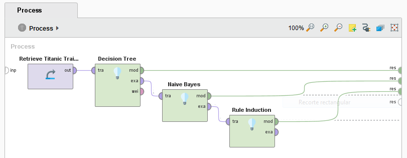
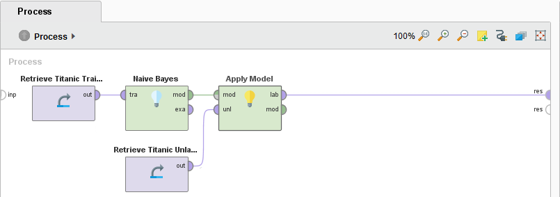
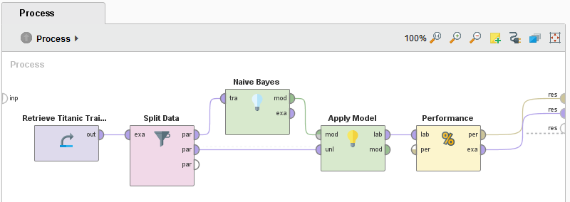
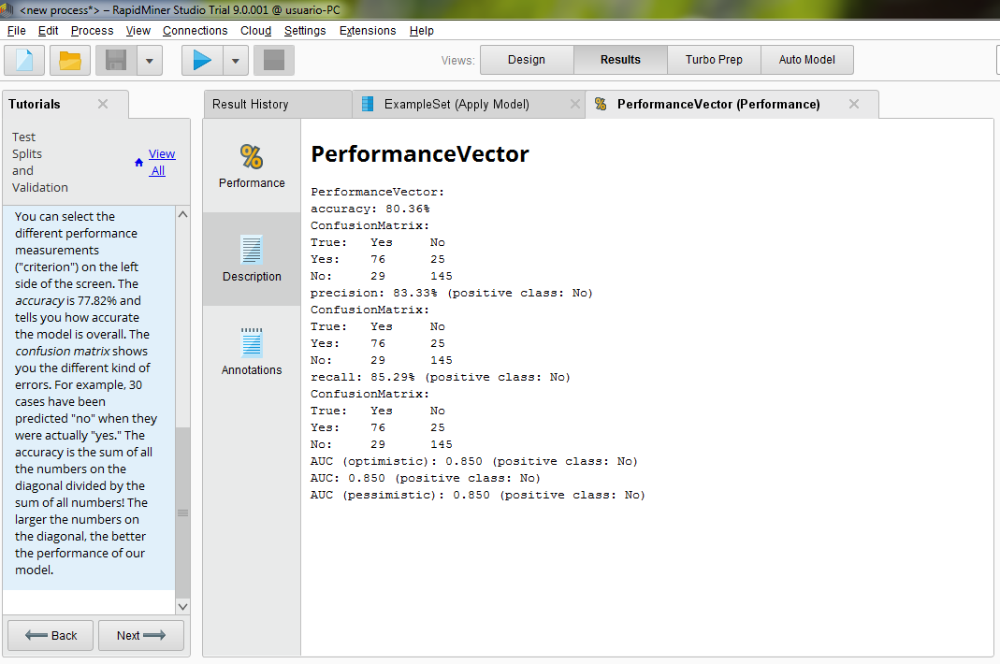
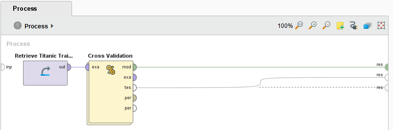
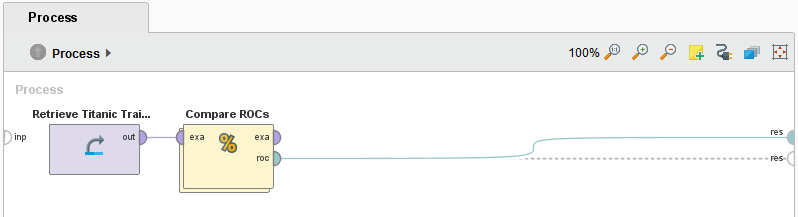
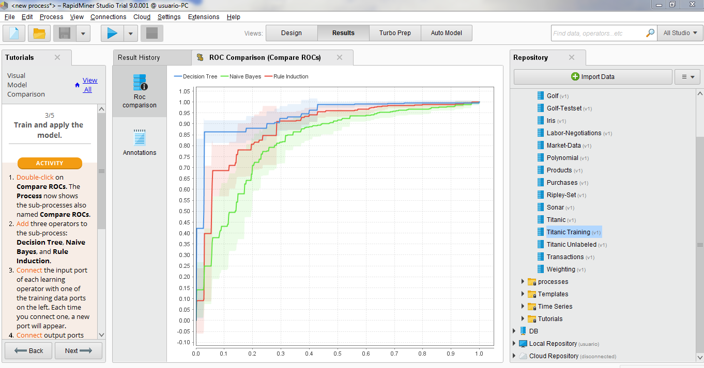

### **UT02 - Práctico Individual 02**

#### Ejercicio 01 - Parte 1 - Tutorial Modeling (Rapidminer)

En éste caso el atributo de salida (Label) es "Survived".
Para Utilizar Árboles de decisión, necesito datos de entrenamiento, los mismos tienen que ya estar pre-clasificados.

Resultados:

RuleModel
if Sex = Male and Passenger Fare = 26.269 then No  (57 / 367)
if Sex = Female and Passenger Class = First then Yes  (97 / 4)
if Sex = Male and Passenger Fare > 31.137 then No  (33 / 90)
if Passenger Class = Second and Age = 28.500 then Yes  (36 / 4)
if Passenger Fare = 24.808 and Passenger Fare > 15.373 and Age > 29.441 then Yes  (18 / 3)
if Passenger Fare = 14.281 then Yes  (68 / 40)
if Passenger Class = Third and Passenger Fare > 23.746 then No  (1 / 23)
if Passenger Class = Second and Passenger Fare > 30.375 then Yes  (4 / 0)
if No of Parents or Children on Board = 0.500 and Age = 30.441 and Passenger Fare = 28.710 and Age > 28.500 then No  (1 / 8)
if Age = 54 then Yes  (33 / 22)
if Age = 71 then No  (0 / 6)
else Yes  (0 / 0)

correct: 750 out of 915 training examples.

Claramente para las mujeres, a la hora de predecir quien se salva, importa más el tamaño de la familia que la clase en la que viaja.
En general el hombre tiene bajas probabilidades de salvarse.

#### 

#### Ejercicio 01 - Parte 2 - Tutorial Modeling (Rapidminer)

En éste caso el operador "Apply Model" toma como entrada datos "sin clasificar" (sin "Label"), le aplica el modelo salida de Naives Bayes
y predice según el modelo las salidas de los datos sin clasificar (dataset Titanic Unlabeled).
Los resultados son los datos originales (sin clasificar), con una columna para la predicción (Sobrevive: Sí/No), y 2 columnas con la
"certeza" de si sobrevive o no ("Confidence(Yes)" y "Confidence(No)"). 

#### 

#### Ejercicio 01 - Parte 3 - Tutorial Test Splits and Validation (Rapidminer)

Una de las grandes preguntas en Machine Learning es ¿Qu{e tan bien predice el modelo que utilizo? Si bien esto depende de muchas cosas, un detalle importante a tener en cuenta es no utilizar los datos de entrenamiento para test, ya que el modelo fué entrenado con estos datos, y podrá predecirlos con facilidad. Para esto lo ideal es guardar un grupo de datos (ya clasificados) para validar el modelo (sin usarlos en el entrenamiento). Para ésto dividimos el dataset en un conjunto de entrenamiento (70%) y un conjunto de test (30%).

#### 

#### Confusion_Matrix_UT02_-_PDI02_-_Ejercicio01--03

#### 

#### Ejercicio 01 - Parte 4 - Tutorial Cross Validation (Rapidminer)

#### 

#### Ejercicio 01 - Parte 5 - Tutorial Visual Model Comparison (Rapidminer)

#### 

#### ROC_Comparsion_-_UT02_-_PDI02_-_Ejercicio01--05

#### 
