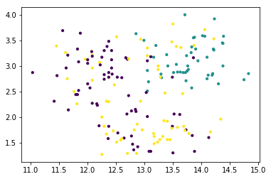
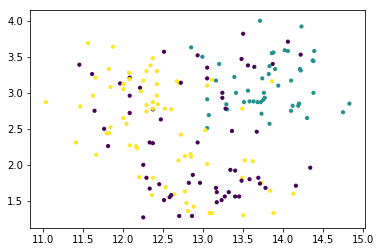

```python
import pandas as pd
```


```python
from sklearn import datasets
from sklearn.cluster import KMeans
import matplotlib.pyplot as plt
unDSData = pd.read_csv("./wine_con_nombres.csv")
unDSName = pd.read_csv("./wineNames.csv")
```


```python
unDSData.head(10)
```


<div>
<style scoped>
    .dataframe tbody tr th:only-of-type {
        vertical-align: middle;
    }

    .dataframe tbody tr th {
        vertical-align: top;
    }

    .dataframe thead th {
        text-align: right;
    }
</style>
<table border="1" class="dataframe">
  <thead>
    <tr style="text-align: right;">
      <th></th>
      <th>Class</th>
      <th>Alcohol</th>
      <th>Malic acid</th>
      <th>Ash</th>
      <th>Alcalinity of ash</th>
      <th>Magnesium</th>
      <th>Total phenols</th>
      <th>Flavanoids</th>
      <th>Nonflavanoid phenols</th>
      <th>Proanthocyanins</th>
      <th>Color intensity</th>
      <th>Hue</th>
      <th>OD280OD315</th>
      <th>Proline</th>
    </tr>
  </thead>
  <tbody>
    <tr>
      <th>0</th>
      <td>1</td>
      <td>14.23</td>
      <td>1.71</td>
      <td>2.43</td>
      <td>15.6</td>
      <td>127</td>
      <td>2.80</td>
      <td>3.06</td>
      <td>0.28</td>
      <td>2.29</td>
      <td>5.64</td>
      <td>1.04</td>
      <td>3.92</td>
      <td>1065</td>
    </tr>
    <tr>
      <th>1</th>
      <td>1</td>
      <td>13.20</td>
      <td>1.78</td>
      <td>2.14</td>
      <td>11.2</td>
      <td>100</td>
      <td>2.65</td>
      <td>2.76</td>
      <td>0.26</td>
      <td>1.28</td>
      <td>4.38</td>
      <td>1.05</td>
      <td>3.40</td>
      <td>1050</td>
    </tr>
    <tr>
      <th>2</th>
      <td>1</td>
      <td>13.16</td>
      <td>2.36</td>
      <td>2.67</td>
      <td>18.6</td>
      <td>101</td>
      <td>2.80</td>
      <td>3.24</td>
      <td>0.30</td>
      <td>2.81</td>
      <td>5.68</td>
      <td>1.03</td>
      <td>3.17</td>
      <td>1185</td>
    </tr>
    <tr>
      <th>3</th>
      <td>1</td>
      <td>14.37</td>
      <td>1.95</td>
      <td>2.50</td>
      <td>16.8</td>
      <td>113</td>
      <td>3.85</td>
      <td>3.49</td>
      <td>0.24</td>
      <td>2.18</td>
      <td>7.80</td>
      <td>0.86</td>
      <td>3.45</td>
      <td>1480</td>
    </tr>
    <tr>
      <th>4</th>
      <td>1</td>
      <td>13.24</td>
      <td>2.59</td>
      <td>2.87</td>
      <td>21.0</td>
      <td>118</td>
      <td>2.80</td>
      <td>2.69</td>
      <td>0.39</td>
      <td>1.82</td>
      <td>4.32</td>
      <td>1.04</td>
      <td>2.93</td>
      <td>735</td>
    </tr>
    <tr>
      <th>5</th>
      <td>1</td>
      <td>14.20</td>
      <td>1.76</td>
      <td>2.45</td>
      <td>15.2</td>
      <td>112</td>
      <td>3.27</td>
      <td>3.39</td>
      <td>0.34</td>
      <td>1.97</td>
      <td>6.75</td>
      <td>1.05</td>
      <td>2.85</td>
      <td>1450</td>
    </tr>
    <tr>
      <th>6</th>
      <td>1</td>
      <td>14.39</td>
      <td>1.87</td>
      <td>2.45</td>
      <td>14.6</td>
      <td>96</td>
      <td>2.50</td>
      <td>2.52</td>
      <td>0.30</td>
      <td>1.98</td>
      <td>5.25</td>
      <td>1.02</td>
      <td>3.58</td>
      <td>1290</td>
    </tr>
    <tr>
      <th>7</th>
      <td>1</td>
      <td>14.06</td>
      <td>2.15</td>
      <td>2.61</td>
      <td>17.6</td>
      <td>121</td>
      <td>2.60</td>
      <td>2.51</td>
      <td>0.31</td>
      <td>1.25</td>
      <td>5.05</td>
      <td>1.06</td>
      <td>3.58</td>
      <td>1295</td>
    </tr>
    <tr>
      <th>8</th>
      <td>1</td>
      <td>14.83</td>
      <td>1.64</td>
      <td>2.17</td>
      <td>14.0</td>
      <td>97</td>
      <td>2.80</td>
      <td>2.98</td>
      <td>0.29</td>
      <td>1.98</td>
      <td>5.20</td>
      <td>1.08</td>
      <td>2.85</td>
      <td>1045</td>
    </tr>
    <tr>
      <th>9</th>
      <td>1</td>
      <td>13.86</td>
      <td>1.35</td>
      <td>2.27</td>
      <td>16.0</td>
      <td>98</td>
      <td>2.98</td>
      <td>3.15</td>
      <td>0.22</td>
      <td>1.85</td>
      <td>7.22</td>
      <td>1.01</td>
      <td>3.55</td>
      <td>1045</td>
    </tr>
  </tbody>
</table>
</div>


```python
unDSData.info()
```

    <class 'pandas.core.frame.DataFrame'>
    RangeIndex: 178 entries, 0 to 177
    Data columns (total 14 columns):
    Class                   178 non-null int64
    Alcohol                 178 non-null float64
    Malic acid              178 non-null float64
    Ash                     178 non-null float64
    Alcalinity of ash       178 non-null float64
    Magnesium               178 non-null int64
    Total phenols           178 non-null float64
    Flavanoids              178 non-null float64
    Nonflavanoid phenols    178 non-null float64
    Proanthocyanins         178 non-null float64
    Color intensity         178 non-null float64
    Hue                     178 non-null float64
    OD280OD315              178 non-null float64
    Proline                 178 non-null int64
    dtypes: float64(11), int64(3)
    memory usage: 19.5 KB
    


```python
unKmeans = KMeans(n_clusters=3, init = 'random', max_iter = 1, random_state = 5).fit(wineDF.iloc[:,[12,1]])
wineDF = pd.DataFrame(unDSData)
wineDF.Class = wineDF.Class - 1
fig, ax = plt.subplots(1, 1)
calcCentroidesDF = pd.DataFrame(unKmeans.cluster_centers_, columns = list(wineDF.iloc[:,[12,1]].columns.values))
wineDF.plot.scatter(x = 'Alcohol', y = 'OD280OD315', c= unKmeans.labels_, figsize=(14,9), colormap='viridis', ax=ax, mark_right=False)
calcCentroidesDF.plot.scatter(x = 'Alcohol', y = 'OD280OD315', c = 'red', ax = ax,  s = 120, mark_right=False)
```


    <matplotlib.axes._subplots.AxesSubplot at 0x167b764f748>





```python
otrokmeans = KMeans(n_clusters=3, init = 'random', max_iter = 1, random_state = 5).fit(wineDF.iloc[:,[12,1]])
y_kmeans = otroKmeans.predict(wineDF)
wineDF.plot.scatter(x = 'Alcohol', y = 'OD280OD315', c= y_kmeans, figsize=(12,8), colormap='viridis', ax=ax, mark_right=False)
otroKmeans = KMeans(algorithm='auto', copy_x=True, init='k-means++', max_iter=300, n_clusters=3, n_init=10, n_jobs=1, precompute_distances='auto', random_state=None, tol=0.0001, verbose=0)
otroKmeans.fit(wineDF) 
kmeansY = otroKmeans.predict(wineDF)
plt.scatter(x = wineDF.Alcohol, y = wineDF.OD280OD315, c=y_kmeans, s=10, cmap='viridis')
```


    <matplotlib.collections.PathCollection at 0x167b7750dd8>





```python

```
